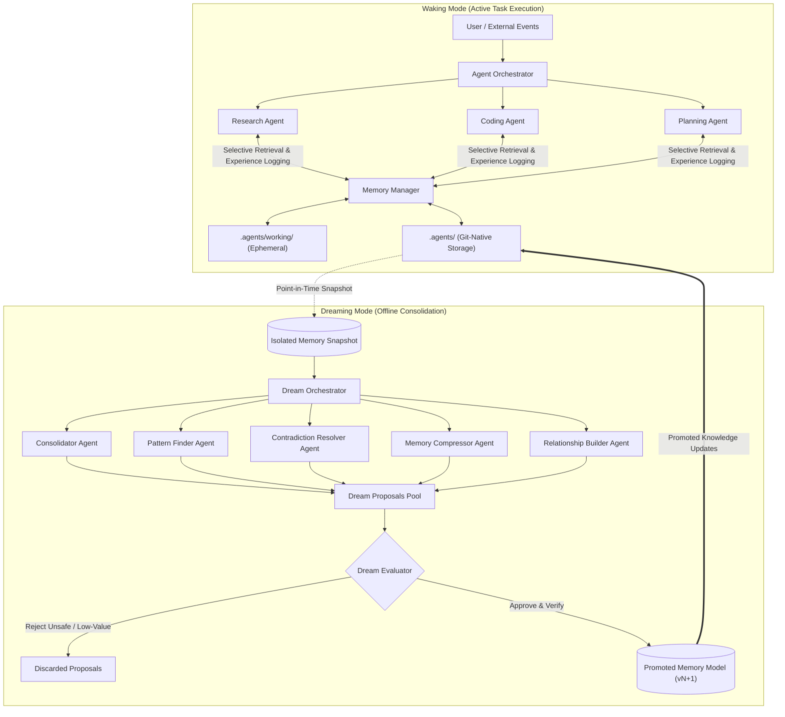
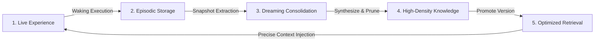

# Dreaming Multi-Agent Memory System

An architectural framework for cognitive, memory-efficient multi-agent AI systems. The architecture separates active execution from offline knowledge consolidation, enabling autonomous agents to accumulate experience, synthesize durable knowledge, and collaborate over long horizons without context window degradation.

---

## 1. Executive Summary & Core Philosophy

State-of-the-art Large Language Model (LLM) agent architectures face critical memory challenges:
- **Context Bloat:** Stuffing complete conversation histories into prompts causes token exhaustion, high inference costs, and attention degradation ("lost in the middle").
- **Transient Experience:** Agents forget insights, discoveries, and decisions once a session concludes.
- **Fragmented Multi-Agent State:** Multiple agents working on shared goals either duplicate knowledge or operate with conflicting assumptions.
- **Naive Vector Search Limitations:** Vector databases identify surface textual similarity, but cannot resolve contradictions, track changing facts over time, synthesize higher-level patterns, or prune obsolete beliefs.

The **Dreaming Multi-Agent Memory System** resolves these challenges by introducing a biologically inspired cognitive architecture grounded in a single central philosophy:

> **Waking agents generate experience. Memory stores experience. Dreaming turns experience into durable knowledge. Retrieval gives each agent only the precise knowledge it needs.**

---

## 2. System Modes

The system operates across two distinct, complementary modes:

```
+-----------------------------------------------------------------------+
|                             SYSTEM MODES                              |
+------------------------------------+----------------------------------+
|            WAKING MODE             |          DREAMING MODE           |
|        (Active Execution)          |      (Offline Consolidation)     |
+------------------------------------+----------------------------------+
| - Orchestrator delegates tasks     | - Runs asynchronously in bg      |
| - Specialized agents execute work  | - Operates on memory snapshot    |
| - Selective, compact retrieval     | - Merges duplicate memories      |
| - New experiences recorded to log  | - Resolves contradictions        |
| - Fast, latency-critical           | - Synthesizes knowledge graph    |
+------------------------------------+----------------------------------+
```

### Waking Mode (Operational State)
During waking mode, the system serves users and responds to live events:
- An **Agent Orchestrator** receives incoming tasks and delegates them to specialized agents (e.g., Research, Coding, Planning).
- Each agent receives only its immediate task instructions and a compact, highly relevant subset of memory (typically 5–20 focused records), rather than full conversational histories.
- Agents perform work and emit observations, decisions, and artifacts back to the memory manager as newly formed experience records.

### Dreaming Mode (Consolidation State)
Dreaming is an engineering metaphor for asynchronous, offline memory consolidation rather than a claim about machine consciousness:
- The system periodically captures an isolated snapshot of long-term memory.
- While waking agents continue operating uninterrupted, specialized **Dream Agents** analyze this snapshot in the background.
- Dreaming processes identify redundancies, reconcile conflicting statements, abstract recurring behaviors into generalized knowledge, construct relationship graphs, and prune stale information.
- The resulting memory improvements are vetted by an evaluator and promoted as the new canonical memory model.

---

## 3. High-Level Architecture

The end-to-end lifecycle forms a dual-phase feedback loop connecting waking execution with offline dreaming:



---

## 4. Fundamental Paradigm: Shared Memory vs. Shared Context

A guiding architectural tenet of this system is:

> **Shared memory does not mean shared context.**

In traditional multi-agent systems, agents frequently exchange bloated context windows containing full transcripts of all prior discussions. This approach degrades model attention and rapidly hits token limits.

In this architecture:
- Multiple agents share access to a single, unified memory repository.
- Each agent operates within a minimal, task-specific context window.
- The retrieval engine isolates and supplies only the specific subset of facts, constraints, and historical decisions directly pertinent to the agent's current objective.

---

## 5. Memory Taxonomy

Memory is partitioned into four distinct functional tiers, each serving a specific temporal and operational purpose:

```
+--------------------------------------------------------------------------+
|                            MEMORY TAXONOMY                               |
+----------------------+--------------------+-------------+----------------+
| Memory Type          | Content            | Lifespan    | Speed / Scope  |
+----------------------+--------------------+-------------+----------------+
| Working Memory       | Active dialog,     | Minutes to  | In-memory,     |
|                      | tool outputs,      | hours       | single session |
|                      | intermediate steps |             |                |
+----------------------+--------------------+-------------+----------------+
| Episodic Memory      | Specific events,   | Days to     | Append-only,   |
|                      | what occurred,     | months      | chronological, |
|                      | who acted, when    |             | full trace     |
+----------------------+--------------------+-------------+----------------+
| Semantic Memory      | Distilled facts,   | Permanent / | Structured,    |
|                      | conventions, rules,| versioned   | high-value,    |
|                      | verified decisions |             | cross-session  |
+----------------------+--------------------+-------------+----------------+
| Shared Project State | Project tech stack,| Dynamic     | Globally       |
|                      | milestones, active | project     | visible to     |
|                      | team constraints   | lifecycle   | all agents     |
+----------------------+--------------------+-------------+----------------+
```

1. **Working Memory:** The scratchpad of the active agent. Holds current dialogue state, tool arguments, raw outputs, and temporary hypotheses. Cleared or flushed upon task completion.
2. **Episodic Memory:** An observational log of interactions and outcomes. Retains temporal and contextual fidelity (e.g., *"Agent B encountered dependency error X when running build Y at timestamp T"*).
3. **Semantic Memory:** Durable, generalized knowledge derived from experience. Independent of the exact circumstance in which it was learned (e.g., *"The project backend requires Python 3.13 and uses PostgreSQL as its primary database"*).
4. **Shared Project State:** Centrally managed coordination data that aligns all collaborating agents on technology choices, active milestones, and global project constraints.

---

## 6. Memory Scoping & Access Hierarchy

To ensure information is not accidentally over-generalized, memories are assigned explicit structural scopes:

```
Global Scope
  └── User Scope
       └── Project Scope
            └── Task Scope
                 └── Session Scope
                      └── Agent Scope
```

- **Scope Isolation:** Prevents ephemeral reasoning or task-specific quirks from polluting the global knowledge base.
- **Access Control:** Waking agents retrieve information bounded by their operational scope (e.g., an agent executing Task 3 only receives memories from the relevant Project and Task scopes, excluding unrelated tasks).
- **Promotion Across Scopes:** When a pattern appears repeatedly across individual task sessions, dreaming agents can propose elevating that knowledge from Task scope to Project or User scope.

---

## 7. Memory Admission Pipeline

Not every conversational turn or tool execution deserves permanent retention. Storing uncurated data degrades retrieval accuracy and wastes resources.

The **Memory Admission Pipeline** filters and refines incoming observations before long-term persistence:

```
Raw Interaction / Tool Output
              │
              ▼
   [ Candidate Extraction ]
              │
              ▼
   [ Importance Filtering ]      ───> Below threshold? Discard
              │
              ▼
    [ Deduplication Check ]      ───> Redundant? Increment evidence count
              │
              ▼
  [ Summarization & Clean-up ]   ───> Strip noise, format concisely
              │
              ▼
   [ Semantic Classification ]   ───> Assign type, scope, metadata
              │
              ▼
  Durable Long-Term Storage
```

### Admission Criteria & Signals
- **Durability:** Is this statement temporary chatter (e.g., *"Let's proceed"*) or lasting knowledge (e.g., *"API rate limit is 60 req/min"* )?
- **Importance vs. Confidence:** Decoupled metrics ensuring that critical yet unverified assertions are treated differently from low-significance confirmed facts.
- **Novelty & Recurrence:** Whether the information introduces new concepts or reinforces existing memories with fresh evidence.
- **Source Reliability:** Weights evidence based on the trustworthiness of the reporting agent or data source.

---

## 8. Hybrid Retrieval Engine

Effective memory retrieval requires more than basic keyword matching or naive vector search. The system utilizes a multi-signal hybrid retrieval architecture:

```
                         User Query / Task Context
                                     │
                     ┌───────────────┴───────────────┐
                     ▼                               ▼
            Dense Semantic Search         Structured Metadata Search
          (Embedding Similarity)        (Scope, Type, Project, Tags)
                     │                               │
                     └───────────────┬───────────────┘
                                     ▼
                        [ Multi-Signal Re-Ranker ]
                                     │
                                     ├── Semantic Vector Proximity
                                     ├── Scope Hierarchy Alignment
                                     ├── Temporal Recency & Decay
                                     ├── Importance & Confidence Scores
                                     └── Knowledge Graph Proximity
                                     │
                                     ▼
                         Top N Relevant Memories
                         (Injected into Agent Context)
```

By combining dense vector embeddings with exact metadata filters and graph relationship distances, agents receive precise, context-rich memories without hallucinations or irrelevant context stuffing.

---

## 9. The Dreaming Engine: Offline Knowledge Consolidation

Dreaming is the periodic, reflective phase of the memory system. While waking agents focus on immediate task completion, the dreaming engine steps back to ask:

> *What should be retained, merged, compressed, connected, corrected, archived, or forgotten?*

### Snapshot Isolation & Safety
Dreaming never operates directly on live, mutable working memory. Instead:
1. The system creates a point-in-time snapshot of long-term memory.
2. Waking agents continue serving requests against the live database without latency or lock contention.
3. Dream agents conduct experiments, syntheses, and restructuring exclusively within the isolated snapshot workspace.
4. If an experimental consolidation introduces regressions or inconsistencies, the snapshot is discarded without endangering production state.

---

## 10. Specialized Dream Agents

Rather than relying on a single monolithic prompt to reorganize memory, the dreaming engine coordinates specialized dream agents, each focused on a distinct cognitive operation:

```
                            DREAM ORCHESTRATOR
                                     │
       ┌───────────────┬─────────────┼─────────────┬───────────────┐
       ▼               ▼             ▼             ▼               ▼
 [Consolidator] [Pattern Finder] [Contradiction] [Compressor] [Relationship]
                                  [ Resolver  ]                 [ Builder  ]
```

### 1. Consolidator
Identifies redundant or overlapping memories generated across multiple sessions and unifies them into canonical records.
- *Input:*
  - *"We use PostgreSQL."*
  - *"Backend database is Postgres."*
  - *"Our primary relational DB is PostgreSQL 16."*
- *Output:*
  - *"The project uses PostgreSQL 16 as its primary relational database."*

### 2. Pattern Finder
Scans across disparate sessions, projects, and agents to discover recurring themes, successful heuristics, or systemic bottlenecks.
- Elevates localized observations into overarching best practices or structural insights.

### 3. Contradiction Resolver
Identifies conflicting statements across memory records (e.g., *"System uses MySQL"* vs. *"System uses PostgreSQL"*).
- Analyzes timestamps, evidence trails, source authority, and subsequent project decisions.
- Deprecates obsolete claims while maintaining historical provenance rather than silently deleting past context.

### 4. Memory Compressor
Synthesizes sprawling episodic histories into dense, high-level summaries while preserving critical causal milestones and evidence citations.
- Prevents database bloating over months of continuous operation.

### 5. Relationship Builder
Constructs explicit semantic edges between isolated memory items, transforming a flat memory store into a queryable **Knowledge Graph**.
- Builds relationships such as: `uses`, `depends_on`, `replaces`, `contradicts`, `supports`, `derived_from`, `part_of`.

### 6. Hypothesis Generator
Notices preliminary trends or correlations that are not yet confirmed facts.
- Formulates tentative hypotheses tagged with low confidence.
- Flags them for verification in future waking sessions as additional evidence accumulates.

---

## 11. Bounded Autonomy: Dream Proposals & The Evaluation Layer

To guarantee system stability, dream agents do not possess direct write access to canonical memory. They operate under a strict governance model:

> **Dream agents propose; the evaluation layer decides.**

```
+--------------------------------------------------------------------------+
|                       DREAM PROPOSAL LIFECYCLE                           |
+--------------------------------------------------------------------------+
|  Dream Agents Generate Proposals:                                        |
|  - CREATE: Introduce new synthesized knowledge or hypotheses             |
|  - MERGE: Combine multiple redundant records into one                    |
|  - UPDATE: Refine confidence, scope, or content                          |
|  - LINK: Establish semantic relationships in the knowledge graph         |
|  - ARCHIVE / DEPRECATE: Mark obsolete or superseded knowledge            |
|                                                                          |
|                                     │                                    |
|                                     ▼                                    |
|  Dream Evaluator Scores Proposals:                                       |
|  - Evidence Quality: Is the proposal backed by verifiable citations?     |
|  - Consistency: Does it resolve conflict without creating new anomalies? |
|  - Information Density: Does it genuinely compress redundancy?           |
|  - Safety & Alignment: Does it preserve critical project constraints?    |
|                                                                          |
|                                     │                                    |
|                  ┌──────────────────┴──────────────────┐                 |
|                  ▼                                     ▼                 |
|         [ Rejected Proposals ]               [ Approved Proposals ]      |
|           Logged for audit                     Promoted to Memory vN+1   |
+--------------------------------------------------------------------------+
```

This separation of proposal generation from evaluation ensures that autonomous self-modification remains bounded, verifiable, and safe.

---

## 12. Memory Governance, Versioning & Validation

### Immutable Memory Versioning
Memory is treated as a versioned artifact rather than an untraceable mutable store:
$$\text{Memory } v_{1} \xrightarrow{\text{Dream Cycle}} \text{Memory } v_{2} \xrightarrow{\text{Dream Cycle}} \text{Memory } v_{3}$$
- Every dream run produces a new version tag.
- Complete rollback capability: If a promoted version degrades retrieval performance, the system can instantly revert to a prior known-good version.
- Auditing: Every modification links back to the responsible dream agent, the proposal rationale, and the supporting evidence.

### Pre-Promotion Validation Checklist
Before any dream cycle is committed to production memory, it must satisfy strict automated validation gates:
- **Integrity:** All relational links and foreign references remain valid.
- **Consistency:** Contradictions are reduced, not introduced.
- **Compression:** Net storage footprint of consolidated concepts decreases without information loss.
- **Retrieval Quality:** High-importance baseline memories remain readily discoverable under benchmark queries.
- **Provenance:** Every newly synthesized memory retains full traceability back to raw episodic events.

---

## 13. Memory Decay, Archiving & Intelligent Forgetting

Human cognition remains effective because the brain deliberately forgets unimportant details. A synthetic memory system that retains every character indefinitely will inevitably suffer from high latency, noise, and ballooning costs.

The system implements a four-stage memory lifecycle:

```
[ Active ] ───(Access diminishes / Age increases)───> [ Stale ]
                                                          │
                                         (Dream cycle evaluation)
                                                          │
                                                          ▼
[ Deleted / Purged ] <───(Retention limit)─── [ Archived ]
```

1. **Active:** High relevance, high confidence, frequently accessed. Fully available in primary hybrid retrieval.
2. **Stale:** Infrequently accessed, aging, or low importance. Re-ranked lower during standard retrieval queries.
3. **Archived:** Removed from daily operational retrieval to keep search fast and noise-free. Retained in cold storage for historical auditing and deep forensic review.
4. **Deleted / Purged:** Permanently erased when explicitly instructed or upon reaching retention limits for temporary tasks.

---

## 14. Cross-Agent Learning & Emergent Intelligence

In complex environments, no single agent possesses the complete picture. The dreaming system serves as the collective synthesis engine for the entire agent collective:

```
   Research Agent                Coding Agent               Planning Agent
(Finds tech constraint)      (Encounters build bug)       (Tracks milestone risk)
          │                            │                             │
          └────────────────────────────┼─────────────────────────────┘
                                       ▼
                           Raw Episodic Memories
                                       │
                                [ Dream Cycle ]
                                       │
                                       ▼
                       Higher-Level Project Insight:
  "The current build failure is caused by an upstream library incompatibility
      identified during research, jeopardizing the Friday milestone."
```

By synthesizing cross-agent observations offline, the system achieves an emergent understanding that no individual agent explicitly discovered or formulated on its own.

---

## 15. The Continuous Closed-Loop Feedback Cycle

The mature system operates as a self-improving cognitive loop:



1. **Waking Agents** execute tasks and encounter novel real-world situations.
2. **Experiences** are screened and stored in episodic memory.
3. **Dreaming** periodically consolidates, reorganizes, and verifies accumulated experience.
4. **Durable Knowledge** is formed and structured into the semantic memory model.
5. **Enhanced Retrieval** injects higher-quality, lower-noise context into subsequent waking agent tasks, leading to better decision-making and continuous autonomous improvement.

---

## 16. Paradigm Comparison: Vector Stores vs. Dreaming Memory

```
+------------------------------------+------------------------------------+
|       STANDARD VECTOR STORE        |    DREAMING MULTI-AGENT MEMORY     |
+------------------------------------+------------------------------------+
| Answers:                           | Answers:                           |
| "What stored text is semantically  | "What do we know, why do we know   |
| similar to this query string?"     | it, is it still valid, what        |
|                                    | contradicts it, and how important  |
|                                    | is it?"                            |
+------------------------------------+------------------------------------+
| Static, append-only embeddings     | Dynamic, continuously consolidated |
|                                    | knowledge representations          |
+------------------------------------+------------------------------------+
| Retains conflicting facts side-by- | Actively detects and resolves      |
| side without resolution            | contradictions                     |
+------------------------------------+------------------------------------+
| Context grows linearly; no         | Synthesizes, compresses, and       |
| proactive summarization            | archives repetitive experiences    |
+------------------------------------+------------------------------------+
| No concept of memory lifecycle,    | Built-in decay, forgetting,        |
| decay, or intentional forgetting   | archiving, and versioning          |
+------------------------------------+------------------------------------+
| Unbounded context bloat over long  | Constant, predictable context size |
| operating horizons                 | with high signal-to-noise ratio    |
+------------------------------------+------------------------------------+
```

---

## 17. Git-Native `.agents/` Storage Architecture

To eliminate opaque binary database merge conflicts and support seamless multi-developer team collaboration, the memory engine is implemented using a **Git-native file-and-directory structure** under `.agents/`:

```text
.agents/
├── project_state.json               # Shared Project State: Milestones, tech stack, constraints
├── versions.json                    # Version registry & promotion audit log
├── semantic/                        # Semantic Memory: Human-readable, Git-versioned Markdown files
│   ├── mem_186cc0e2.md              # Consolidated Benchmark Baseline
│   ├── mem_2f3e8543.md              # Architectural Insight: Dynamic Query Evaluation
│   ├── mem_64ba7b30.md              # Systemic Vulnerability Pattern: Unencrypted PII
│   └── archive/                     # Superseded or archived semantic records
├── episodic/                        # Episodic Memory: Append-only observational interaction logs
│   ├── episodic_log.jsonl           # Active episodic records (JSON Lines)
│   └── archive/                     # Consolidated / archived historical traces
└── working/                         # Working Memory: Ephemeral session scratchpads (.gitignored)
    └── session_active.json
```

### Team Collaboration & Pull-Request Driven Knowledge
- **Human-Readable & Editable:** Developers can open any `.agents/semantic/*.md` file directly in their editor to inspect, modify, or manually add rules for their agents.
- **Git Diffs for AI Learning:** Every dream consolidation produces clean Markdown diffs that can be committed, reviewed in GitHub PRs, and shared instantly across the engineering team.
- **Zero Infrastructure:** No hosted database servers or credentials required. Running `git clone` instantly provides the complete team memory baseline.

---

## 18. Summary

The **Dreaming Multi-Agent Memory System** provides the missing cognitive layer for long-running autonomous AI systems. By decoupling real-time task execution from offline memory consolidation, it delivers:
- **Scalable multi-agent collaboration** without exponential context growth.
- **Durable institutional knowledge** that compounds over time.
- **Traceable, versioned, and verifiable** memory operations.
- **Self-refining intelligence** that transforms raw experience into actionable wisdom.
